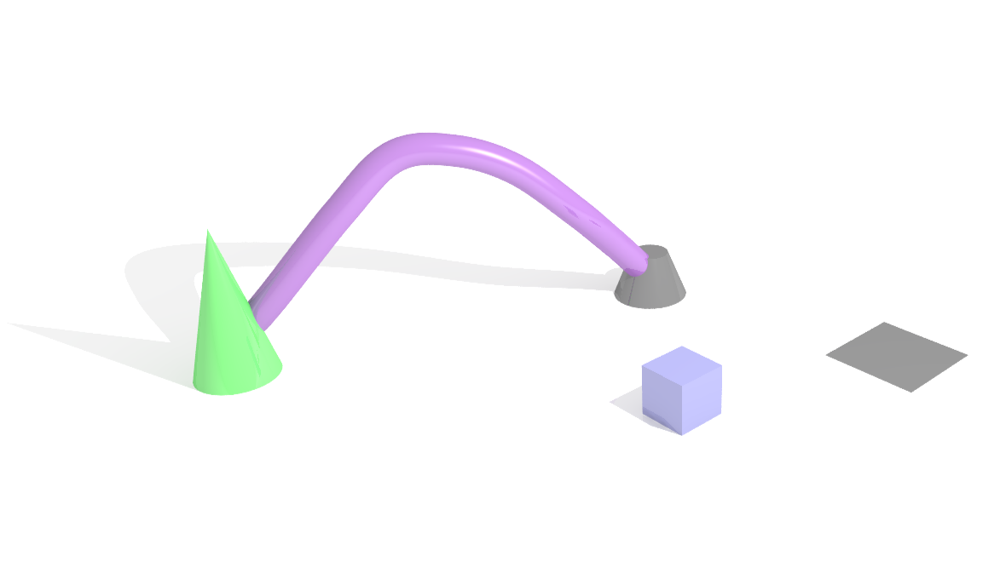
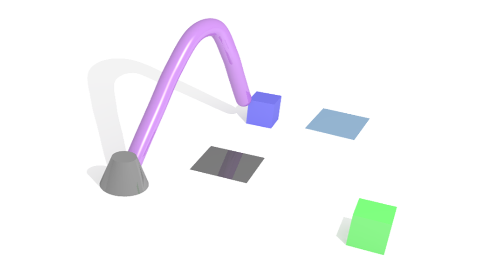
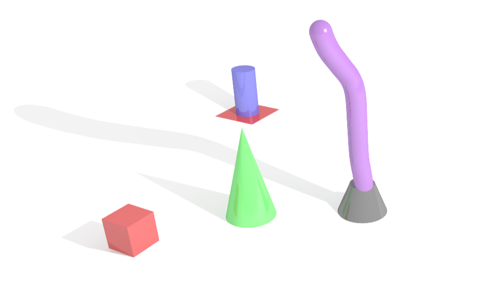
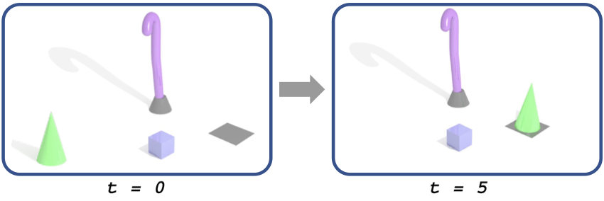
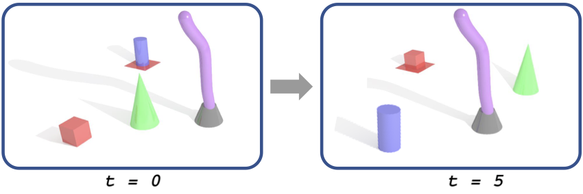

<!-- # RoboSoft'25: The 1st International Workshop on Vision-Language in Soft Robot -->

## Overview

Natural organisms, particularly soft-bodied animals, effectively explore and interact with their environments using highly redundant structures. Inspired by nature, engineers have integrated soft materials into rigid robotic joints, leading to significant advancements in the field of soft robotics. This innovative design enables robots to bend, twist, and continuously deform along their entire length. The inherently deformable nature of soft robots provides safe and adaptive solutions, especially in applications such as human-robot collaboration, search and rescue operations, and exploration and manipulation in unstructured environments.

However, soft robots are inherently underactuated, highly nonlinear mechanical systems, immersed in an elastic potential field and subject to dissipative forces that contribute to their stability. This underactuated nature, combined with the complex dynamics, presents significant challenges in controlling soft robots. These challenges have attracted researchers from various fields, including mechanical engineering, control theory, and computer science.

Recent advances in multimodal learning, particularly the integration of vision and language, offer a promising direction for improving soft robot autonomy. By leveraging vision-language models, soft robots can interpret human instructions in natural language while grounding their actions in visual perception. Therefore, this workshop focuses on multimodal soft robot planning, aiming to develop efficient control strategies that bridge the gap between high-level human intent and low-level robot execution. The ultimate goal is to enhance the adaptability and usability of soft robots in real-world applications.

## Invited Speakers

  

    
    <!-- https://cosimodellasantina.eu/ -->
    
<a href="#">Cosimo Della Santina</a> TU Delft

  

  

    
    <!-- https://sites.google.com/view/homepageoflixiang -->
    
<a href="#">Xiang LI</a> Tsinghua University

  

  

    
    <!-- https://vipl.ict.ac.cn/homepage/sqjiang/index.html -->
    
<a href="#">Shuqiang Jiang</a> Chinese Academy of Sciences

  

  

    
    <!-- https://www.ruc-aim3.com/people.html -->
    
<a href="#">Qin Jin</a> Renmin University of China

  

  

    
    <!-- https://scholar.google.com/citations?user=CcbnBvgAAAAJ&hl=en -->
    
<a href="#">Jiebo Luo</a> University of Rochester

  

## Schedule

*Tentative schedule - Half-day workshop*

| Time | Event |
|-------------|-------------|
| TBD | Opening Remarks |
| TBD | Invited Talk: Cosimo Della Santina |
| TBD | Invited Talk: Xiang LI |
| TBD | Invited Talk: Shuqiang Jiang |
| TBD | Coffee Break |
| TBD | Invited Talk: Qin Jin |
| TBD | Invited Talk: Jiebo Luo |
| TBD | Invited Talk: Mohan Kankanhalli |
| TBD | Challenge Results Announcement |
| TBD | Challenge Winner Presentations |
| TBD | Paper Presentations |
| TBD | Panel Discussion & Closing Remarks |

## Challenge

To advance research in multimodal soft robot planning, we propose two challenge tasks:

### Task 1: Vision-Language Manipulation for Soft Robot

In this task, a soft robot operates within a cluttered workspace containing various objects, such as cubes, spheres, and cones. One end of the soft robot is fixed to the surface, while the other end moves freely to perform manipulation. The robot receives natural language instruction and multi-perspective visual observations as inputs. The instruction specifies the objects to be manipulated and their target locations.

  

    
    
Instruction: "pick up the cone and place it in the gray area on the right side of the workspace."

  

  

    
    
Instruction: "pick up the blue cylinder on the left and place it in the gray area."

  

  

    
    
Instruction: "place the blue cube in the blue area and then place the green cube in the green area."

  

  

    
    
Instruction: "pick up the red cube behind the tall cone and place it in the red area."

  

#### Easy-Track: Single-Object Manipulation
In the Easy-Track, each instruction involves only one object. For example, an instruction might be: "Pick up the cone and place it in the gray area on the right side of the workspace."

  
  
Illustration of Task 1 Easy-Track: The soft robot must reach the cone and place it in the target area while avoiding collision with the cube in between.

#### Hard-Track: Multi-Object Manipulation
The Hard-Track increases complexity by involving multiple objects within a single manipulation task. For example, an instruction might be: "Pick up the red cube behind the tall cone and place it in the red area."

  
  
Illustration of Task 1 Hard-Track: The soft robot must first move the cone and cylinder obstacles before placing the cube in its target location.

### Task 2: Vision-Language Navigation for Soft Robot

Soft robot vision-language navigation establishes a novel research field for embodied intelligence where compliant robots execute navigation tasks through morphological adaptation in dynamic environments.

  

    
    
Easy-Track: Navigation in sparse obstacles example

  

  

    
    
Easy-Track: Different view of navigation with sparse obstacles

  

  

    
    
Hard-Track: Navigation in dense obstacles example

  

  

    
    
Hard-Track: Multiple sub-goals navigation scenario

  

<!-- ### Evaluation Metrics

We adopt four metrics to evaluate the performance:

1. **Success Rate (SR)**: Defined as the ratio of successfully completed tasks within the maximum steps.
   
   

     
   

2. **Average Collision Rate (CR)**: Measures safety performance by considering both self-collisions and environmental collisions.
   
   

     
   

3. **Task Completion Efficiency (TCE)**: Evaluates the model efficiency using the normalized inverse steps.
   
   

     
   

4. **Comprehensive Evaluation Score (CES)**: A weighted composite score incorporating the above evaluation metrics.
   
   

     
   
 -->

## Program Committee

  

    
    
<a href="#">Si Liu</a> Beihang University

  

  

    
    <!-- http://softrobotics.buaa.edu.cn/peoples.html -->
    
<a href="#">Li Wen</a> Beihang University

  

  

    
    <!-- https://chengaopro.github.io/ -->
    
<a href="#">Chen Gao</a> Beihang University

  

  

    
    <!-- http://softrobotics.buaa.edu.cn/peoples.html -->
    
<a href="#">Ziyu Ren</a> Beihang University

  

  

    
    <!-- https://scholar.google.com/citations?user=-TokIr8AAAAJ&hl=zh-CN&oi=ao -->
    
<a href="#">Luting Wang</a> Beihang University

  

  

    
    <!-- http://softrobotics.buaa.edu.cn/peoples.html -->
    
<a href="#">Jiaqi Liu</a> Beihang University

  

  

    
    
<a href="#">Heqing Yang</a> Beihang University

  

  

    
    <!-- http://softrobotics.buaa.edu.cn/peoples.html -->
    
<a href="#">Xingyu Chen</a> Beihang University

  

  

    
    <!-- http://softrobotics.buaa.edu.cn/peoples.html -->
    
<a href="#">Youning Duo</a> Beihang University

  

## Challenge Technical Committee

  

    
    
<a href="#">Ziyu Wei</a> Beihang University

  

  

    
    <!-- http://softrobotics.buaa.edu.cn/peoples.html -->
    
<a href="#">Jiasheng Wu</a> Beihang University

  

  

    
    <!-- http://softrobotics.buaa.edu.cn/peoples.html -->
    
<a href="#">Ruipu Wu</a> Beihang University

  

## Call for Papers

This workshop aims to bring together researchers and practitioners from different disciplines to share ideas and methods on soft robot learning. We welcome research contributions as well as best-practice contributions on (but not limited to) the following topics:

- Multimodal robot manipulation in constrained environments.
- Multimodal navigation with mobile robots.
- Learning-based paradigms for soft robot control.
- Multimodal perception and modeling for soft-bodied robots.

All submissions must be original work not under review at any other workshop, conference, or journal. The workshop will accept papers describing completed work as well as work in progress. One submission format is accepted: full paper, which must follow the formatting guidelines of the main conference ACM MM 2025.

## Important Dates

- Paper submission deadline: July 11, 2025
- Paper notification: August 1, 2025
- Camera-ready submission: August 3, 2025
- Challenge submission deadline: July 30, 2025
- Workshop date: October 27–28, 2025

## Prizes

- Prizes for each track winner
- Best paper award

<!-- KaTeX -->
<link rel="stylesheet" href="https://cdn.jsdelivr.net/npm/katex@0.16.4/dist/katex.min.css">

